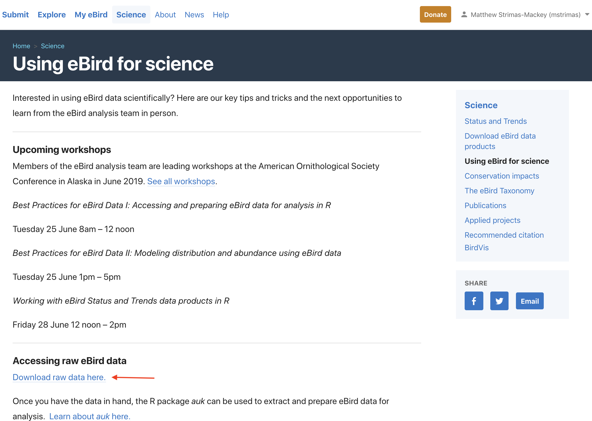

# Data Access {#access}

The complete eBird database (with the exception of sensitive species and observations that haven't been approved) is provided via the [eBird Basic Dataset (EBD)](https://ebird.org/science/download-ebird-data-products), a large tab-separated text file released monthly. To start working with eBird data, we need to download this file. To access the EBD, you will need to [create an eBird account](https://secure.birds.cornell.edu/cassso/account/create) and sign in to eBird. Once signed in, from the [eBird homepage](https://ebird.org/), click on the [Science tab](https://ebird.org/science) then scroll down to click on [Using eBird for science](https://ebird.org/science/download-ebird-data-products) in the right-hand menu. This page compiles links to a variety datasets, tools, and educational material for using eBird data to do science; it's a great resource!



CLick on the "Download raw data here" link, then proceed to the eBird Basic Dataset page. If you haven't already done so, you will need to submit a request to access the EBD. You can do this after the workshop if you haven't already, we won't need access today. From this page you can download the eBird Basic Dataset, a large tab-separated text file that contains (nearly) every eBird observation. In this file, each row corresponds to an observation of a species on a checklist. On this page, you can also download the Sampling Event Data. In this file, each row corresponds to a checklist rather than a species observation. We'll see why this file is important later in the workshop.


The EBD is huge, so **don't download these files now**. Instead, we'll be working with a small subset of the data today, which can be downloaded from the following links:

- eBird Basic Dataset: https://github.com/mstrimas/ebp-workshop/raw/master/raw-data/ebd_2015-2016_yucatan.tar
- Sampling Event Data: https://github.com/mstrimas/ebp-workshop/raw/master/raw-data/ebd_sampling_2015-2016_yucatan.tar

This subset contains data from Yucatan Peninsula (Guatemala, Belize, and five Mexican sates) from 2015-2016.

The files will be in `.tar` format, and you should be unarchive them (this may require 7-Zip on Windows). The resulting directories will contain files with extension `.txt.gz`, these files should be uncompressed to produce two text files (`ebd__2015-2016_yucatan.txt` and `ebd_sampling_2015-2016_yucatan.txt`). Move these files to a sensible, central location on your computer. When working with the full dataset, the EBD will be over 200 GB! If this is too large to fit on your computer, it can be stored on an external hard drive. We'll also talk later in the workshop about some ways of avoiding downloading the EBD.

<div class="checkpoint">
  <h2>Checkpoint</h2>
  Are the files downloaded and unarchived into a central location?
</div>

Let's take a look at this dataset. If we were working with the full EBD, we wouldn't have enough memory to read in the whole file, but we can always read a small subset. Open a new R script (`01_ebird-data.R`) and read in the first few lines:

```{r access-top}
library(readr)
library(auk)

ebd_top <- read_tsv("~/data/ebird/ebd_2015-2016_yucatan.txt", n_max = 5)
```

View this dataframe within RStudio. Scroll over to the `SAMPLING EVENT DATA` column, which uniquely identifies checklists, and note the value: `S21914547`. With this ID we can access any non-private checklist via the website by appending it to `https://ebird.org/view/checklist/`. [Look at the checklist online](https://ebird.org/view/checklist/S21914547) and compare it to the EBD. Notice two things that distiguish eBird data from other citizen science data:

1. eBird collects data on the observation process, including the survey protocol used and effort information. This facilitates more robust analyses because we can account for variation in the observation process.
2. Complete checklists enable non-detection to be inferred from the data. Without this, there's no way to distinguish whether a species was not observered or just not reported.

For these reasons, we refer to data from complete eBird checklists with effort information as **semi-structured** to distinguish from both most unstructured citizen science data and traditional structure scientific surveys.

<div class="exercise">
  <h2>Exercise</h2>
  Take a few minutes to explore the EBD and compare it to the checklists online.
</div>

Notice above that we had to reference the full path to the text files. In general, it's best to avoid using absolute paths in R scripts because it makes them less portable–if you're sharing the files with someone else, they'll need to change the file paths to point to the location where they've stored the eBird data. The R package `auk` provides a workaround for this, by allowing users to set an environment variable (`EDB_PATH`) that points to the directory containing the eBird data. To set this variable, use the function [`auk_set_ebd_path()`](https://cornelllabofornithology.github.io/auk/reference/auk_set_ebd_path.html). For example, if the EBD and Sampling Event Data files are in `~/data/ebird/`, use:

```{r access-ebdpath, eval = FALSE}
auk_set_ebd_path("~/data/ebird/")
```

The function `auk_ebd()` creates an R object referencing the EBD text file. Now that we've set up an EBD path, we can reference the EBD directly within `auk_ebd()` even though it's not in our working directory.

```{r access-aukebd}
# the file isn't in out working directory
file.exists("ebd_2015-2016_yucatan.txt")
# yet auk can still find it
auk_ebd("ebd_2015-2016_yucatan.txt")
```

You should now see the EBD text file referenced as `Input` in this `auk_ebd` object. The remainder of the information printed will be the topic of the next section.

<div class="checkpoint">
  <h2>Checkpoint</h2>
  Were you able to create an `auk_ebd` object referencing the EBD without specifying the full path?
</div>