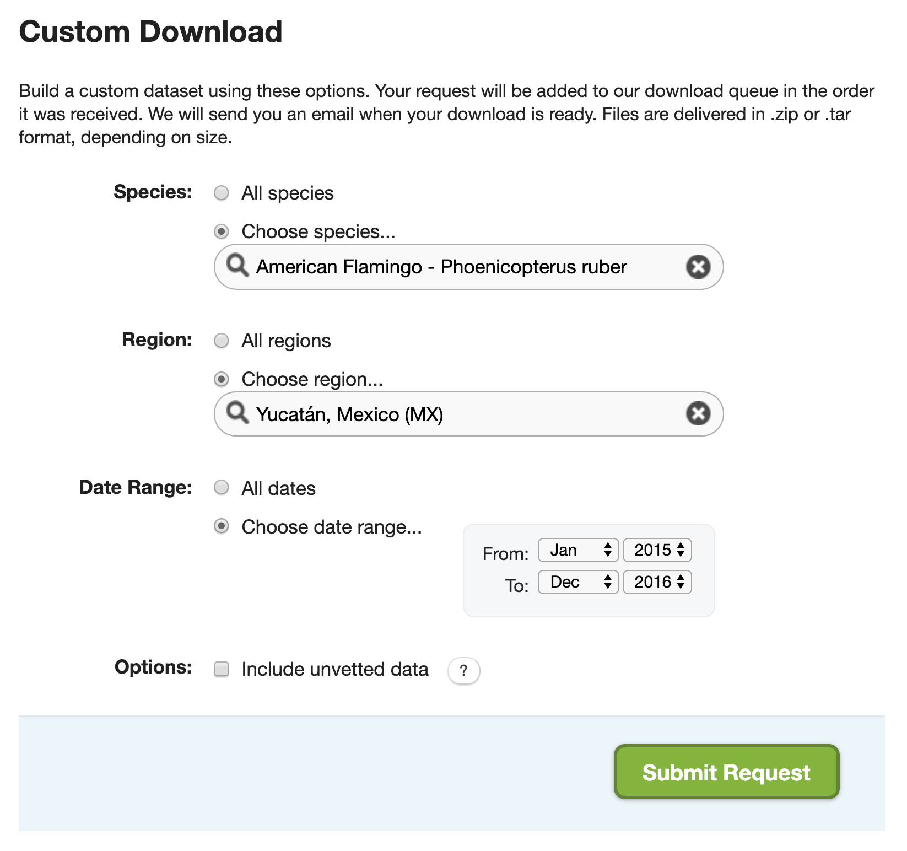

# Advanced Topics {#advanced}

## Custom downloads {#advanced-custom}

The full EBD is massive (over 200 GB) and takes a long time to process with `auk` (typically several hours). In some cases, there is a way around these issues. On the [EBD download page](https://ebird.org/data/download/ebd), there is a Custom Download form that allows you to only download a subset of the EBD for a given species, within a region, and for a range of dates. After submitting this form, the request will be processed on the eBird servers and a email will be sent to you with instructions for downloading the EBD extract.



Recall from the [lesson on zero-filling](#presabs--filter), that we extracted American Flamingo records from Mexico's Yucatán state in January, and produced presence-absence data from this extract. Let's try to do this with the Custom Download form. After the request is submitted an email will arrive with instrustions for [downloading the following file](https://github.com/mstrimas/ebp-workshop/raw/master/raw-data/ebd_MX-YUC_grefla2_201501_201612_relApr-2019.zip). Download and unarchive this file, placing the text file in the `data/` subdirectory of your project.

```{r advanced-custom-dl}
tf <- "data/temp.zip"
download.file("https://github.com/mstrimas/ebp-workshop/raw/master/raw-data/ebd_MX-YUC_grefla2_201501_201612_relApr-2019.zip", tf)
unzip(tf, "ebd_MX-YUC_grefla2_201501_201612_relApr-2019.txt", exdir = "data/")
unlink(tf)
```

It will quickly become clear that there are two issues with this approach. First, the set of filters available in the Custom Download form is limited. For example, there's no option to only extract observations from complete checklists or any way to get observations from a given month from any year. To address this, we can apply the additional filters after we've imported the data in R. Specifically, we'll only keep observations from complete checklists in June.

```{r advanced-custom-filter}
library(auk)
library(lubridate)
library(tidyverse)

ebd <- read_ebd("data/ebd_MX-YUC_grefla2_201501_201612_relApr-2019.txt") %>% 
  filter(month(observation_date) == 1, 
         all_species_reported)
```

The second challenge is that the Custom Download form only provides the positive observations from the EBD, it doesn't provide the corresponding Sampling Event Data for zero-filling. However, the Sampling Event Data is much smaller than the EBD and quicker to process. So, we can easily filter this file using the same set of filters we've already applied to the EBD. Note that `auk_sampling()` is used in place of `auk_ebd()` when we're only filtering the sampling data and not the EBD.

```{r advanced-custom-sed}
f_sed <- "data/sed-only_amefla.txt"
sed_filt <- auk_sampling("ebd_sampling_2015-2016_yucatan.txt") %>% 
  auk_state("MX-YUC") %>% 
  auk_date(c("*-01-01", "*-01-31")) %>% 
  auk_complete() %>% 
  auk_filter("data/sed-only_amefla.txt")
sed <- read_sampling(f_sed)
```

Finally, we can join these combine those two dataframes together with `auk_zerofill()` to produce zero-filled presence-absence data.

```{r advanced-custom-zerofill}
ebd_zf <- auk_zerofill(ebd, sed, collapse = TRUE)
```

We've produced exactly the same data as in Lesson \@ref(presabs); however, we've done so avoiding having to deal with the full EBD.

## Preparing for occupancy modeling {#advanced-unmarked}

One common use of eBird data is for occupancy modeling with the R package `unmarked`. This workshop won't cover occupancy modeling; however, `unmarked` requires data to be formatted in a very particular way and `auk` contains functions to prepare data in this way, which we'll cover in this lesson.

## Reducing file size {#advanced-size}

## Land cover covariates {#advanced-modis}

```{r cleanup, echo = FALSE}
unlink(list.files("data/", full.names = TRUE))
```


